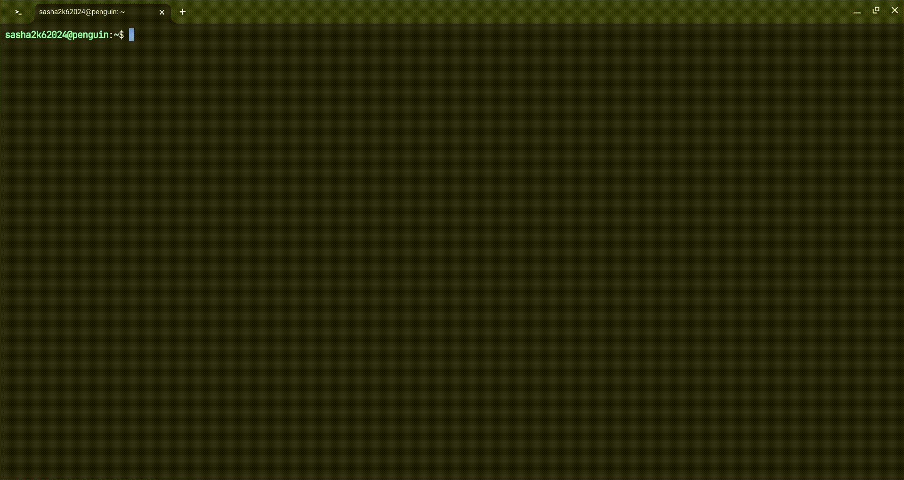

# neovim
My own neovim configuration
# Preview

### Plugins
- [bufferline.nvim](https://github.com/akinsho/bufferline.nvim)
    > A snazzy bufferline for Neovim
- [coc.nvim](https://github.com/neoclide/coc.nvim)
    > Nodejs extension host for vim & neovim, load extensions like VSCode and host language servers.
- [lazy.nvim](https://github.com/folke/lazy.nvim)
    > 💤 A modern plugin manager for Neovim
- [lualine.nvim](https://github.com/nvim-lualine/lualine.nvim)
    > A blazing fast and easy to configure neovim statusline plugin written in pure lua.
- [mini.nvim](https://github.com/echasnovski/mini.nvim)
    > Library of 40+ independent Lua modules improving overall Neovim (version 0.8 and higher) experience with minimal effort
- [neo-tree.nvim](https://github.com/nvim-neo-tree/neo-tree.nvim)
    > Neovim plugin to manage the file system and other tree like structures.
- [noice.nvim](https://github.com/folke/noice.nvim)
    > 💥 Highly experimental plugin that completely replaces the UI for messages, cmdline and the popupmenu.
- [nui.nvim](https://github.com/MunifTanjim/nui.nvim)
    > UI Component Library for Neovim.
- [nvim-notify](https://github.com/rcarriga/nvim-notify)
    > A fancy, configurable, notification manager for NeoVim
- [nvim-treesitter](https://github.com/nvim-treesitter/nvim-treesitter)
    > Nvim Treesitter configurations and abstraction layer
- [nvim-web-devicons](https://github.com/nvim-tree/nvim-web-devicons)
    > lua `fork` of vim-web-devicons for neovim
- [plenary.nvim](https://github.com/nvim-lua/plenary.nvim)
    > plenary: full; complete; entire; absolute; unqualified. All the lua functions I don't want to write twice.
- [vim-autoformat](https://github.com/vim-autoformat/vim-autoformat)
    > Provide easy code formatting in Vim by integrating existing code formatters.
- [vscode.nvim](https://github.com/Mofiqul/vscode.nvim)
    > Neovim/Vim color scheme inspired by Dark+ and Light+ theme in Visual Studio Code
- [which-key.nvim](https://github.com/folke/which-key.nvim)
    > 💥 Create key bindings that stick. WhichKey helps you remember your Neovim keymaps, by showing available keybindings in a popup as you type.
- [markdown-preview.nvim](https://github.com/iamcco/markdown-preview.nvim)
    > Preview Markdown in your modern browser with synchronised scrolling and flexible configuration.
### Installing
```sh
git clone https://github.com/HotWizard/neovim/tree/main
cd neovim && ./install.sh
```
