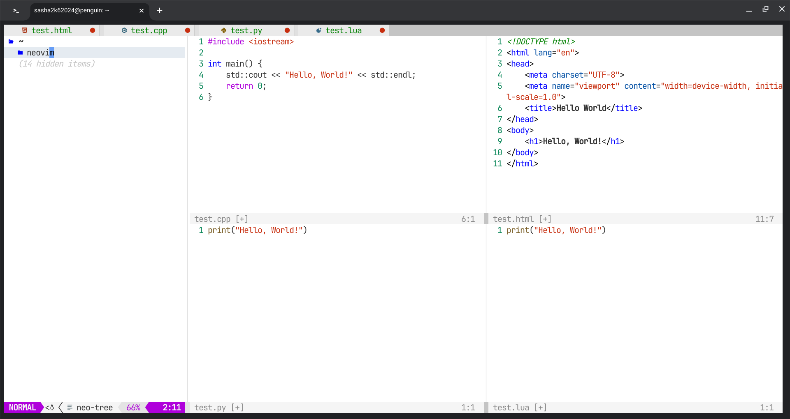

# neovim
My own neovim configuration
# Preview

### Plugins
1. [lazy.nvim](https://github.com/folke/lazy.nvim)
    > 💤 A modern plugin manager for neovim
2. [nvim-cmp](https://github.com/hrsh7th/nvim-cmp)
    > A completion plugin for neovim coded in Lua.
    1. [cmp-nvim-lsp](https://github.com/hrsh7th/cmp-nvim-lsp)
        > nvim-cmp source for neovim builtin LSP client
    2. [cmp-buffer](https://github.com/hrsh7th/cmp-buffer)
        > nvim-cmp source for buffer words
    3. [cmp-path](https://github.com/hrsh7th/cmp-path)
        > nvim-cmp source for path
    4. [cmp-cmdline](https://github.com/hrsh7th/cmp-cmdline)
        > nvim-cmp source for vim's cmdline
3. [bufferline.nvim](https://github.com/akinsho/bufferline.nvim)
    > A snazzy bufferline for Neovim
4. [lualine.nvim](https://github.com/nvim-lualine/lualine.nvim)
    > A blazing fast and easy to configure neovim statusline plugin written in pure lua.
5. [LuaSnip](https://github.com/L3MON4D3/LuaSnip)
    > Snippet Engine for Neovim written in Lua.
6. [mini.nvim](https://github.com/echasnovski/mini.nvim)
    > Library of 40+ independent Lua modules improving overall Neovim (version 0.8 and higher) experience with minimal effort
7. [neo-tree.nvim](https://github.com/nvim-neo-tree/neo-tree.nvim)
    > Neovim plugin to manage the file system and other tree like structures.
8. [noice.nvim](https://github.com/folke/noice.nvim)
    > 💥 Highly experimental plugin that completely replaces the UI for messages, cmdline and the popupmenu.
9. [nui.nvim](https://github.com/MunifTanjim/nui.nvim)
    > UI Component Library for Neovim.
10. [nvim-lspconfig](https://github.com/neovim/nvim-lspconfig)
    > Quickstart configs for Nvim LSP
11. [nvim-notify](https://github.com/rcarriga/nvim-notify)
    > A fancy, configurable, notification manager for NeoVim
12. [nvim-treesitter](https://github.com/nvim-treesitter/nvim-treesitter)
    > Nvim Treesitter configurations and abstraction layer
13. [nvim-web-devicons](https://github.com/nvim-tree/nvim-web-devicons)
    > lua `fork` of vim-web-devicons for neovim
14. [plenary.nvim](https://github.com/nvim-lua/plenary.nvim)
    > plenary: full; complete; entire; absolute; unqualified. All the lua functions I don't want to write twice.
15. [neoformat](https://github.com/sbdchd/neoformat)
    > ✨ A (Neo)vim plugin for formatting code.
16. [vscode.nvim](https://github.com/Mofiqul/vscode.nvim)
    > Neovim/Vim color scheme inspired by Dark+ and Light+ theme in Visual Studio Code
17. [which-key.nvim](https://github.com/folke/which-key.nvim)
    > 💥 Create key bindings that stick. WhichKey helps you remember your Neovim keymaps, by showing available keybindings in a popup as you type.
18. [markdown-preview.nvim](https://github.com/iamcco/markdown-preview.nvim)
    > markdown preview plugin for (neo)vim
### ⚠️ Warning ⚠️
[```install.sh```](https://raw.githubusercontent.com/HotWizard/neovim/refs/heads/main/install.sh) script fully uninstalls Neovim from your machine!
### Installing
```sh
git clone https://github.com/HotWizard/neovim
cd neovim && ./install.sh
```
